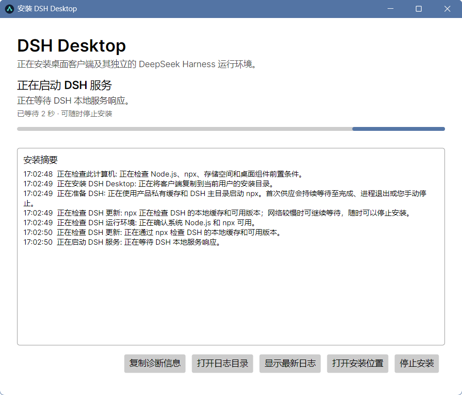

# DeepSeek Harness DIY 生态仓库

这是围绕 DeepSeek Harness（DSH）构建的 DIY Monorepo，用于维护桌面客户端、插件和其他扩展工具。各子项目独立版本、独立发布，同时统一遵循仓库的 Spec Coding 规范。

## 子项目

| 项目 | 简介 | 状态 |
|---|---|---|
| [`dsh-ng-desktop`](dsh-ng-desktop/README.md) | 基于 .NET 10、Avalonia 与 NativeWebView 的 DSH 跨平台桌面客户端，负责 DSH 供应、托盘驻留、自启动、端口与进程管理以及干净卸载。 | Windows `win-x64` 与 macOS `osx-arm64` 未签名社区预览 |

## 快速安装 DSH Desktop

1. 在 Windows x64 或 Apple Silicon macOS 上安装 Node.js，并确认 `node` 与 `npx` 可用。
2. 打开本仓库的 GitHub Releases，选择最新的 `desktop-vX.Y.Z` 版本。
3. Windows 推荐下载 `DSH-Desktop-Setup-vX.Y.Z-win-x64-aot.exe`；已有 .NET 10 环境时也可选择体积更小的 `-dotnet.exe`。Apple Silicon Mac 下载 `DSH-Desktop-Setup-vX.Y.Z-osx-arm64-aot.pkg`。
4. 使用同名 `.sha256` 文件核对安装包后运行。Windows 安装完成会创建桌面和开始菜单快捷方式；macOS 安装到当前用户的“应用程序”目录。

当前公开安装包属于未签名社区预览。Windows SmartScreen 与 macOS Gatekeeper 可能显示警告或阻止首次打开；请只从本仓库 Release 下载并核对 SHA-256，不要导入任何来源提供的根证书或发布者证书，也不要关闭系统的全局安全保护。

桌面客户端的完整安装、使用、卸载和开发说明见 [`dsh-ng-desktop/README.md`](dsh-ng-desktop/README.md)。

## 协作规范

仓库采用“文档即代码”的 Spec Coding 流程：需求、架构、任务状态和验收标准必须先于实现并始终保持同步。

- [全局文档标准](specs/0_DOC_STANDARDS.md)
- [生态规划与点子池](specs/IDEAS.md)
- [AI Agent 协作指南](AGENTS.md)
