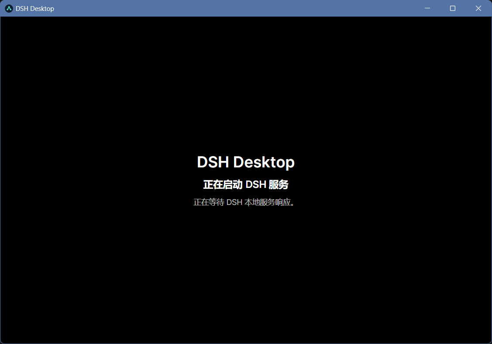
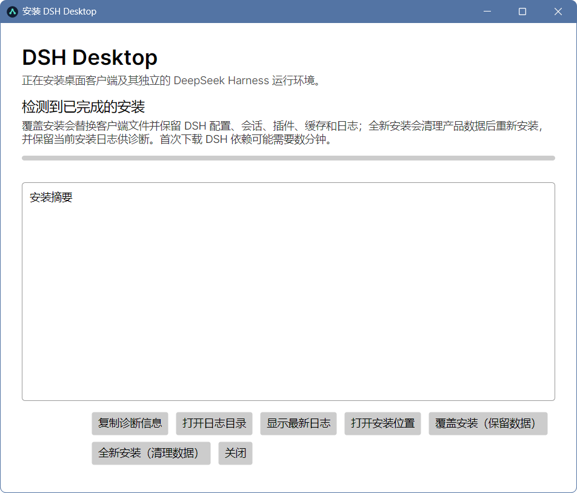
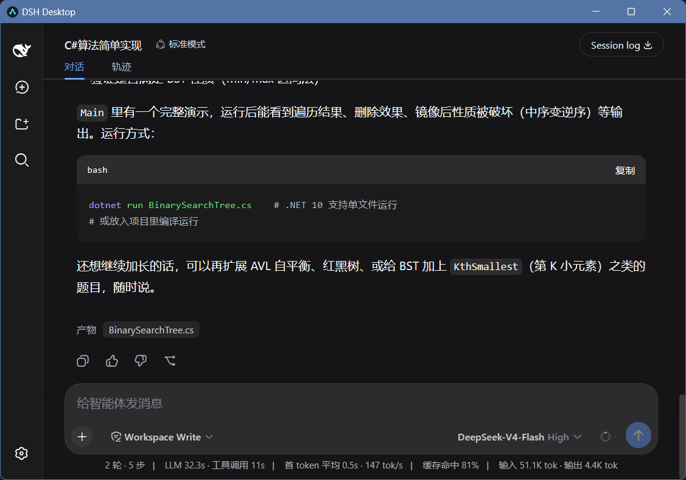

# dsh-ng-desktop

`dsh-ng-desktop` 是 DeepSeek Harness（DSH）的第三方桌面客户端。它不复制或修改 DSH Web UI，而是负责在本机安全地供应和运行 DSH，并通过 Avalonia `NativeWebView` 呈现其原生 Web 界面。

Windows `win-x64` 与 macOS `osx-arm64` 是当前安装包、发布和验收目标。Windows ARM64、macOS Intel 与其他架构仅支持用户从源码自行构建。两个平台的 Release 当前均为未签名社区预览；macOS 不签名、不公证。

## 主要能力

- 使用未锁版本的 `npx @deepseek-ai/dsh web` 供应并启动 DSH，不全局安装 DSH。
- 使用产品私有的 npm cache、`DSH_HOME`、WebView2 数据目录和空白启动目录，不污染用户共享 npm 缓存。
- 通过健康检查确认 DSH Web UI 后再创建 WebView；端口冲突时自动选择并持久化其他 loopback 端口。
- 只管理客户端自己创建的 npx、Node 与 DSH 进程树，不按进程名终止其他 Node 进程。
- 支持原生安装引导、当前用户开机自启动、托盘驻留、单实例、桌面/开始菜单快捷方式和系统卸载入口。
- 关闭主窗口时销毁 WebView2 并隐藏到托盘，DSH 继续在后台运行；从托盘重新打开时重建 WebView。
- 卸载时删除客户端、私有缓存、DSH 配置/凭据/会话和 WebView 数据，但始终保留用户工作区、系统 Node.js 与共享 npm 数据。

## 界面预览







## 系统要求

- Windows 10/11 x64，或搭载 Apple Silicon 的 macOS 14 及更高版本。
- 已安装 Node.js，且 `node` 与 `npx` 位于当前用户可用的 `PATH` 中。
- Windows AOT 和 macOS AOT 安装器不要求 .NET Runtime；Windows .NET 依赖安装器要求 .NET 10 Desktop Runtime。
- 首次运行需要网络访问，以便 npx 获取 DSH。首次供应可能持续数分钟，安装器会持续等待并允许用户安全停止和回滚。

## 安装

在本仓库 GitHub Releases 中打开最新的 `desktop-vX.Y.Z`：

| 下载文件 | 适用场景 |
|---|---|
| `DSH-Desktop-Setup-vX.Y.Z-win-x64-aot.exe` | 推荐；Native AOT 自包含，不要求预装 .NET Runtime |
| `DSH-Desktop-Setup-vX.Y.Z-win-x64-dotnet.exe` | 已安装 .NET 10 Desktop Runtime，希望减小下载体积 |
| `DSH-Desktop-Setup-vX.Y.Z-osx-arm64-aot.pkg` | Apple Silicon Mac；Native AOT 自包含，不要求预装 .NET Runtime |

同时下载对应的 `.sha256`，在 Windows PowerShell 中校验：

```powershell
Get-FileHash .\DSH-Desktop-Setup-vX.Y.Z-win-x64-aot.exe -Algorithm SHA256
Get-Content .\DSH-Desktop-Setup-vX.Y.Z-win-x64-aot.exe.sha256
```

在 macOS 终端中校验：

```bash
shasum -a 256 DSH-Desktop-Setup-vX.Y.Z-osx-arm64-aot.pkg
cat DSH-Desktop-Setup-vX.Y.Z-osx-arm64-aot.pkg.sha256
```

两处哈希值必须一致。当前安装包是未签名社区预览：Windows SmartScreen 警告和 macOS Gatekeeper 警告或阻止首次打开均属于预期现象。确认来源和 SHA-256 后，只按系统提供的单次人工打开流程继续；请勿导入根证书或发布者证书，也不要关闭 Gatekeeper、SIP 或其他全局安全保护。

运行安装器后，原生安装引导会检查 Node.js/npx、部署客户端、供应并验证 DSH，然后注册自启动和受管卸载入口。Windows 会创建当前用户桌面和开始菜单快捷方式，默认安装目录为 `%LocalAppData%\Programs\DSH Desktop`，产品数据位于 `%LocalAppData%\DSH Desktop`。macOS 将应用安装到 `~/Applications/DSH Desktop.app`，产品数据位于当前用户的 `Library/Application Support` 与 `Library/Caches`。

## 日常使用与退出

- Windows 从桌面、开始菜单或托盘的“打开 DSH”启动/显示主窗口；macOS 从 `~/Applications/DSH Desktop.app` 或菜单栏图标打开。
- 点击窗口关闭按钮只会销毁当前 WebView 并隐藏窗口；客户端托盘和 DSH 服务继续运行，减少隐藏期间的 WebView2 内存占用。
- 从托盘再次打开时，客户端会按已通过健康检查的本地地址重新创建 WebView。
- 如需完全停止，请使用托盘菜单“退出”；客户端会先停止自己拥有的 DSH 进程树，再退出。
- 客户端默认随当前用户登录在后台启动。若不需要，可在 Windows“启动应用”设置中禁用；客户端不会擅自重新启用。

## 卸载

在 Windows“设置 → 应用 → 已安装的应用”中卸载 **DSH Desktop**。卸载器会与运行中的客户端握手，销毁 WebView、停止受管 DSH、删除快捷方式与自启动项，然后清理安装目录和产品私有数据（包括配置等），但保留用户在 DSH 中设置的工作区目录。

在 macOS 的 `DSH Desktop.app` 中，运行 `Contents/Resources/Uninstall DSH Desktop.command`。卸载器会先协调运行中的客户端，再删除受管应用、登录项和产品私有数据。

卸载会删除客户端内的 DSH profile、插件、配置、凭据和会话。用户选择的外部工作区及其中的所有文件不会被删除。

## 从源码开发

安装 .NET 10 SDK，在本目录执行：

```powershell
dotnet restore DshNgDesktop.csproj --configfile NuGet.Config
dotnet build DshNgDesktop.csproj --configfile NuGet.Config
dotnet run -- --development
```

`--development` 是源码运行的显式入口。无参数运行发布目录中的 `DshNgDesktop.exe` 不会进入安装事务。

构建 Windows 安装器：

```powershell
.\Installer\Packaging\windows\Build-Installer.ps1 -Mode Aot -RuntimeIdentifier win-x64 -Version v0.9.1
.\Installer\Packaging\windows\Build-Installer.ps1 -Mode DotNet -RuntimeIdentifier win-x64 -Version v0.9.1
```

在 Apple Silicon macOS 上构建未签名安装包：

```bash
bash Installer/Packaging/macos/build-installer.sh --version v0.9.1
```

输出位于 `artifacts/installer/`，该目录由 Git 忽略。完整开发、AOT、签名和验收步骤见 [开发与发布指南](docs/DEVELOPMENT_AND_RELEASE.md)。

## 发布流程

维护者先在 [`CHANGELOG.md`](CHANGELOG.md) 中添加精炼的用户可见更新并提交，自主决定 SemVer 的 major、minor 或 patch。标签版本必须和该 Changelog 条目一致。必须将该发布提交先推送到承载 GitHub Actions 的 GitHub 远程；再在真实 Windows `win-x64` 与 macOS `osx-arm64` 环境分别对最终版本完成人在环安装、首次供应、托盘、自启动、窗口隐藏/恢复、退出、卸载、残留与安全提示检查。验收通过后创建并推送独立桌面标签：

```powershell
git push github main
git tag desktop-v0.9.11 <release-commit>
git push github refs/tags/desktop-v0.9.11
```

上例假定 GitHub 远程名为 `github`、发布提交已在 `main`；请按本地实际远程名和分支替换。只有推送到已启用 GitHub Actions 的 GitHub 仓库，`desktop-v*` 标签才会触发工作流。工作流先校验 Changelog 条目，再在干净的 Windows Runner 重建 x64 AOT/.NET 双安装器、在 Apple Silicon macOS Runner 重建 ARM64 AOT `pkg`，并生成 SHA-256。仅当两个构建均成功时，它才创建未签名社区预览 Release、上传六个附件，并写入 Changelog 更新、提交数量与比较链接；不会自动决定版本号或罗列详细提交日志。维护者不再手工上传安装包；自动构建不能替代推送标签前的真实机器验收。

如果标签先于 Changelog 误推，且 GitHub Release 尚未创建：先补齐并提交 Changelog，再将该提交推送到 GitHub；在 GitHub 删除失败标签后，例如用 `git ls-remote --tags github refs/tags/desktop-v0.9.11` 确认输出为空。删除远端标签不会删除本地标签，因而 `git tag desktop-v0.9.11` 会报告“already exists”。先用 `git show --no-patch desktop-v0.9.11` 检查其目标；若不是正确的发布提交，再执行 `git tag -f desktop-v0.9.11 <release-commit>`，最后执行 `git push github refs/tags/desktop-v0.9.11`。如果 GitHub Release 或附件已经创建，绝不可重用该标签，应发布新的版本号。

## Spec Coding

实现与文档必须保持一致，开发前按顺序阅读：

1. [`specs/1_REQUIREMENTS.md`](specs/1_REQUIREMENTS.md)
2. [`specs/2_ARCHITECTURE.md`](specs/2_ARCHITECTURE.md)
3. [`specs/3_TASKS.md`](specs/3_TASKS.md)
4. [`specs/4_VERIFICATION.md`](specs/4_VERIFICATION.md)

全仓文档标准见 [`../specs/0_DOC_STANDARDS.md`](../specs/0_DOC_STANDARDS.md)。
